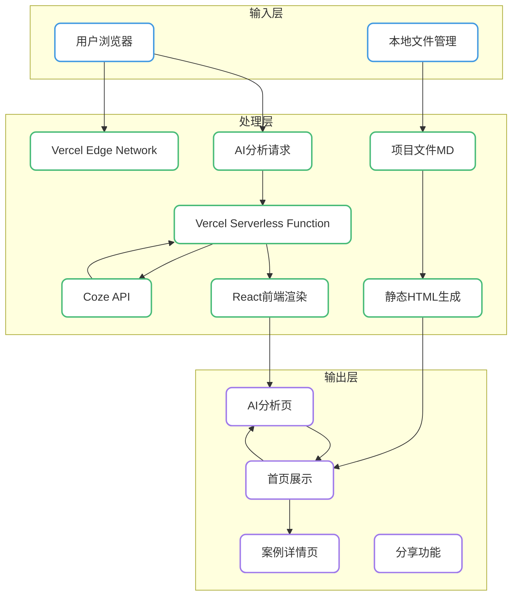

# EasyFolio - 产品PRD

## 1. 产品概述

### 定位

一个轻量级的个人简历作品集生成工具，利用AI能力简化开发工作，为用户提供快速创建专业个人展示网页的解决方案。通过精美的视觉设计和流畅的交互体验，帮助用户展示个人项目案例、专业技能和工作经验，适合通过社交平台分享。

### 核心价值

- **AI驱动的高效创作**：利用Coze AI能力自动分析优化简历内容，快速完成从简历到专业作品集的转化，告别繁琐的手动排版和内容整理
- **轻量化架构**：无需复杂后端配置，一键生成静态网站快速部署，适合非技术用户
- **专业展示**：现代化设计语言，提供沉浸式案例展示体验，提升求职机会
- **安全可靠**：通过Vercel Serverless Function中转保护API密钥，确保数据安全
- **免费使用**：个人用户可零成本部署到Vercel或GitHub Pages
- **体验卓越**：丰富的交互动画和响应式设计，提供优质用户体验

### 目标用户

- **应届毕业生等求职者**：需要专业的简历和作品集提高求职竞争力
  - 痛点：缺乏作品集制作经验，时间紧张，预算有限，需要低成本高效的解决方案；需要重新包装技能和经验突出个人优势
- **内容创作者**：需要通过作品集展示专业能力吸引客户
  - 痛点：缺乏技术能力搭建网站，传统作品集制作耗时，难以突出个人特色

### 目标用户共同特征

- 技术背景：多为非技术或技术基础有限的用户，需要零代码或低代码解决方案
- 时间需求：希望快速完成作品集创建，节省时间用于核心业务或学习
- 预算考虑：倾向于低成本或免费解决方案，避免高额开发和设计费用
- 分享需求：需要方便地分享作品到社交媒体、招聘平台或客户
- 专业追求：希望展示效果专业美观，提升个人品牌形象

### 用户场景示例

- **场景1**：自由设计师接到新客户咨询，需要快速分享作品集链接，通过EasyFolio生成的专业网页获得客户信任
- **场景2**：应届毕业生准备求职，通过EasyFolio将实习经验和项目作品整合成专业作品集，在面试中脱颖而出
- **场景3**：转行人士准备面试新岗位，通过EasyFolio重构个人经历，突出与新岗位相关的技能和项目
- **场景4**：斜杠青年需要在社交媒体分享个人品牌，通过EasyFolio创建整合多元技能的展示页面，吸引合作机会

---

## 2. 核心功能

### 功能模块

| 模块 | 功能描述 | 优先级 | 状态 | 亮点 | 痛点 |
|------|---------|--------|------|------|------|
| **AI简历分析器** | 内置AI对话界面，直接调用Coze API进行简历分析，返回结构化数据和优化建议 | P0 | 已完成 | 实时流式响应，安全的API密钥保护，专业分析能力 | 依赖网络连接，分析准确性需持续优化 |
| **项目作品管理** | 添加、编辑、删除项目案例，支持项目描述、技术栈、成果展示、链接等信息展示 | P0 | 已完成 | 灵活的项目组织，支持多维度展示，Markdown文件管理 | 需要手动编辑文件，不够直观 |
| **一键生成静态网站** | 基于用户数据生成静态HTML网站 | P0 | 已完成 | 零技术门槛，5分钟完成部署 | 生成速度和文件大小需优化 |
| **个人信息管理** | 通过本地配置文件编辑个人基本信息，包括姓名、职位、联系方式等 | P0 | 已完成 | 本地文件管理，简单直接 | 后期需要手动编辑文件，不够直观 |
| **首页展示** | 个人简介、技能展示、案例预览 | P0 | 已完成 | 现代化布局、流畅动画、响应式设计 | 内容固定，需要手动更新 |
| **多语言支持** | 中英文切换、内容国际化 | P0 | 已实现 | 实时切换、HTML标签支持 | 仅支持中英文 |
| **交互体验** | 滚动动画、悬停效果、页面过渡 | P0 | 已实现 | 流畅的动画效果、响应式设计、页面跳转动画 | 动画性能优化空间 |
| **主题定制** | 通过预设主题文件夹和图片资源进行管理，支持主题切换 | P1 | 开发中 | 文件+图片形式管理，简单直接 | 主题定制灵活性需提升 |
| **AI内容优化** | 利用AI生成或优化个人简介、项目描述等内容 | P1 | 待开发 | 专业内容建议，提升展示效果 | 内容个性化程度需加强 |
| **分享功能** | 生成可分享的链接，支持直接分享到社交媒体 | P1 | 待开发 | 一键分享，扩大作品影响力 | 分享统计和效果跟踪功能需完善 |
| **数据统计** | 访客量、浏览时长、页面热度 | P2 | 部分实现 | 基础访问统计、案例浏览记录 | 数据可视化不足 |

### 页面详情

#### 2.1 首页（作品集网站）

##### 2.1.1 页面结构

- **导航栏**：Logo、导航链接（首页、案例、关于我）、语言切换按钮、移动端菜单按钮、「AI分析」跳转按钮
- **Hero区域**：个人简介、职业标签、技能卡片、CTA按钮
- **案例展示区域**：案例卡片网格、案例导航指示器
- **方法论区域**：工作流程、核心能力展示
- **联系区域**：联系方式、社交媒体链接

##### 2.1.2 核心功能

- **个人展示**：显示用户姓名、个人简介
- **技能展示**：通过技能卡片展示专业技能和技术栈
- **案例预览**：卡片布局展示案例缩略图和基本信息
- **语言切换**：支持中英文实时切换
- **响应式设计**：适配桌面端、平板和移动设备
- **AI分析跳转**：一键跳转到AI简历分析器

##### 2.1.3 交互效果

- **滚动动画**：元素进入视口时的淡入效果
- **悬停效果**：卡片和按钮的悬停状态变化
- **页面过渡**：页面跳转时的平滑过渡动画
- **返回顶部**：滚动时显示返回顶部按钮

#### 2.2 AI简历分析页

##### 2.2.1 页面结构

- **左右两栏布局**：左侧进度条和任务规划，右侧聊天区域
- **聊天头部**：标题和简介
- **聊天内容区**：消息气泡列表、流式响应展示
- **输入区域**：消息输入框、发送按钮
- **进度指示**：AI分析进度条和状态提示

##### 2.2.2 核心功能

- **AI对话**：实时与Coze AI进行对话
- **流式响应**：打字机效果逐字显示AI回复
- **任务规划**：自动解析AI响应中的任务列表
- **思考过程**：可展开查看AI的思考过程
- **进度追踪**：可视化显示分析进度

##### 2.2.3 交互效果

- **消息发送**：回车或按钮发送消息
- **自动滚动**：新消息自动滚动到视口
- **任务列表**：动态更新的待办事项
- **思考过程展开**：点击切换显示/隐藏

#### 2.3 案例详情页

##### 2.3.1 页面结构

- **布局**：侧边栏导航 + 主内容区
- **案例头部**：案例编号、项目名称、主标题、标签
- **案例内容**：挑战、解决方案、实施方法、成果展示
- **案例标签**：技术栈、关键词标签
- **项目选择器**：侧边栏项目导航，相关案例推荐
- **页脚**：返回首页链接

##### 2.3.2 核心功能

- **案例详情展示**：详细的项目描述、实施过程和成果
- **标签筛选**：通过标签筛选相关案例
- **项目导航**：快速切换不同案例
- **多语言支持**：案例内容的中英文切换

---

## 3. 技术架构

### 技术栈分析

| 类别 | 技术 | 版本 | 用途 | 评估 |
|------|------|------|------|------|
| 前端框架 | React | 18.x | AI简历分析器界面 | 成熟稳定，生态完善 |
| 构建工具 | Vite | 5.x | 快速开发和构建 | 速度快，配置简单 |
| CSS框架 | Tailwind CSS | 4.x | 样式开发 | 现代化CSS，开发高效 |
| 后端服务 | Vercel Serverless Functions | - | AI API中转 | 无需服务器管理，按需计费 |
| AI服务 | Coze API | - | 简历分析和内容生成 | 强大的AI能力，易于集成 |
| 数据格式 | Markdown | - | 案例内容管理 | 易于编辑，支持富文本 |
| 部署 | Vercel | - | 前端托管和Serverless部署 | 速度快，配置简单 |
| 部署 | GitHub Pages | - | 静态网站托管 | 免费，易于控制 |
| 图标库 | Font Awesome | 6.x | 图标展示 | 丰富的图标资源 |

### 系统架构



### 核心流程

#### 3.1 AI分析流程

```
用户输入消息 → 前端调用 /api/chat → Vercel Serverless Function → Coze API → 返回流式响应 → 前端显示
```

#### 3.2 部署流程

1. **准备阶段**：整理项目文件，编辑配置和案例文件
2. **开发测试**：运行本地开发服务器测试功能
3. **部署上线**：
   - **Vercel**：导入GitHub仓库，配置环境变量，自动部署
   - **GitHub Pages**：推送代码到GitHub仓库，开启Pages功能
4. **验证测试**：检查网站功能和响应式效果
5. **分享推广**：分享网站链接到社交媒体和职业平台

### 安全架构

| 层级 | 安全措施 | 说明 |
|------|----------|------|
| API密钥保护 | Serverless Function中转 | API Key保存在Vercel环境变量中，前端不直接访问 |
| 数据传输 | HTTPS加密 | Vercel默认支持HTTPS，确保数据传输安全 |
| 开发环境 | 本地服务器 | 开发时使用本地服务器，不暴露密钥到前端 |
| 环境隔离 | 环境变量区分 | 开发/生产环境使用不同配置 |

---

## 4. 实施计划

**核心设计理念**：

- **产品化体验**：提供完整的工作流和用户体验，不只是脚本堆砌
- **轻量化架构**：保持代码简洁，无需复杂后端，让用户能理解和修改
- **外部平台赋能**：充分利用成熟的外部服务，避免重复造轮子
- **文档驱动**：用清晰详细的文档降低使用门槛，让非技术用户也能轻松上手

### 4.1 当前状态

| 模块 | 状态 | 备注 |
|------|------|------|
| 作品集网站 | 已完成 | 首页、案例详情页、响应式设计 |
| AI简历分析器 | 已完成 | 聊天界面、流式响应、任务规划 |
| Vercel Serverless Function | 已完成 | AI API中转、安全密钥保护 |
| 开发环境服务器 | 已完成 | 本地开发测试支持 |
| 部署配置 | 已完成 | Vercel部署支持 |

### 4.2 部署配置指南

#### 4.2.1 Vercel部署

**步骤1**：注册Vercel账号并连接GitHub仓库

**步骤2**：配置环境变量
```bash
COZE_API_KEY=your_api_key_here
COZE_BOT_ID=your_bot_id_here
```

**步骤3**：部署命令
```bash
cd easyfolio-ai
npm run build
vercel --prod
```

#### 4.2.2 GitHub Pages部署（作品集网站）

**步骤1**：配置GitHub Actions（已创建 `.github/workflows/deploy.yml`）

**步骤2**：在仓库设置中启用GitHub Pages

**步骤3**：推送代码自动部署

---

## 5. MVP产品描述

### 5.1 MVP核心功能

EasyFolio MVP 是一个完整可用的产品，包含以下核心功能：

1. **精美前端展示**
   - 现代化首页：个人简介、技能展示、案例预览
   - 专业案例详情页：完整的项目展示
   - 多语言支持：中英文实时切换
   - 响应式设计：完美适配桌面、平板、移动设备
   - 流畅交互：滚动动画、悬停效果、页面过渡

2. **AI简历分析器**
   - 内置聊天界面，无需跳转外部平台
   - 通过Vercel Serverless Function安全调用Coze API
   - 流式响应，打字机效果展示
   - 自动解析任务规划列表
   - 可视化分析进度

3. **内容管理工具**
   - 本地Markdown文件管理
   - 项目作品编辑
   - 个人信息配置

4. **一键部署**
   - Vercel部署支持
   - GitHub Pages部署支持
   - 环境变量配置说明

### 5.2 用户旅程

1. **快速入门（5分钟）**
   - 下载EasyFolio
   - 阅读快速入门指南
   - 运行开发服务器预览效果

2. **创建作品集（20分钟）**
   - 编辑个人信息配置
   - 添加1-2个项目案例
   - 本地预览效果

3. **AI辅助分析（可选）**
   - 在AI分析页输入简历内容
   - 获取AI优化建议
   - 将建议应用到作品集

4. **部署上线（10分钟）**
   - 配置Vercel环境变量
   - 运行部署命令
   - 获取网站链接

5. **分享与传播**
   - 获取网站链接
   - 分享到社交媒体、招聘平台

### 5.3 MVP成功标准（量化）

| 维度 | 指标 | 目标值 | 测量方式 |
|------|------|--------|----------|
| **功能完整性** | P0功能实现率 | 100% | 功能检查表 |
| **用户体验** | 新用户完成首个作品集时间 | ≤ 30分钟 | 用户测试 |
| **响应速度** | AI响应延迟 | ≤ 3秒（首字响应） | 性能测试 |
| **部署成功率** | 用户按指南成功部署率 | ≥ 90% | 用户测试 |
| **文档质量** | 文档清晰度评分 | ≥ 4.5/5 | 用户调研 |
| **浏览器兼容性** | 主流浏览器兼容 | Chrome、Firefox、Safari、Edge | 兼容性测试 |
| **响应式适配** | 设备适配数量 | ≥ 3种（桌面、平板、手机） | 响应式测试 |

---

## 6. 产品优势

1. **AI驱动高效**：内置AI分析能力，无需跳转外部平台，一站式完成简历分析
2. **安全可靠**：通过Serverless Function保护API密钥，确保数据安全
3. **专业视觉呈现**：现代化设计语言，流畅动画，提供沉浸式体验
4. **部署灵活多样**：支持Vercel和GitHub Pages部署，用户可自由选择
5. **零技术门槛**：详细文档+清晰步骤，非技术用户也能快速上手
6. **轻量级架构**：基于静态网站生成，无需复杂后端，代码简洁易理解
7. **完整工作流**：从简历分析→内容编辑→生成网站→部署上线，端到端完整体验
8. **可自由扩展**：不做过度封装，用户可根据需要自由修改和扩展

---

## 7. 风险与应对策略

### 7.1 技术风险

| 风险 | 影响 | 可能性 | 应对策略 |
|------|------|--------|----------|
| Coze API服务不可用 | AI分析功能失效 | 低 | 添加错误处理和重试机制，提供友好的错误提示 |
| Serverless函数冷启动延迟 | 首次请求响应慢 | 中 | Vercel自动预热，优化函数性能 |
| 部署配置失败 | 用户部署受挫 | 中 | 提供详细的部署指南和视频教程 |
| 浏览器兼容性 | 功能异常 | 低 | 针对主流浏览器充分测试，提供降级方案 |

### 7.2 应对策略

- **文档优先**：将文档作为产品核心部分，提供快速入门、详细指南、常见问题
- **示例驱动**：提供完整示例项目，用户可直接套用
- **渐进引导**：从简单到复杂，分阶段引导用户掌握
- **社区支持**：建立用户社区，用户互助交流

---

## 8. 成功标准（详细量化）

### 8.1 功能完整性

- [x] 首页展示功能正常（个人简介、技能卡片、案例预览）
- [x] 案例详情页功能正常（项目展示）
- [x] AI简历分析器功能正常（聊天、流式响应、任务规划）
- [x] 多语言切换功能正常（中英文实时切换）
- [x] 响应式设计正常（适配桌面、平板、手机）
- [x] Vercel部署支持（Serverless Function）
- [x] GitHub Pages部署支持（作品集网站）

### 8.2 用户体验

- 新用户从下载到完成首个作品集时间：≤ 30分钟
- 用户按文档成功部署率：≥ 90%
- 文档清晰度用户评分：≥ 4.5/5
- 核心流程无阻断性Bug
- 页面加载时间：≤ 2秒（首屏）
- AI首字响应时间：≤ 3秒

### 8.3 技术质量

- 主流浏览器兼容性：Chrome、Firefox、Safari、Edge最新版本
- 响应式适配：桌面（1920×1080）、平板（768×1024）、手机（375×667）
- 代码规范：100%符合命名规范
- 核心代码注释覆盖率：≥ 30%

### 8.4 产品完整性

- 快速入门指南：完整可用
- 用户手册：完整可用
- 部署指南：Vercel和GitHub Pages完整
- README文档：完整可用
- 常见问题FAQ：≥ 10个常见问题

---

## 9. 总结与建议

EasyFolio 是一个**轻量级但完整的个人简历作品集产品**，通过组合精美的前端展示、安全的AI集成和强大的外部平台，为用户提供快速创建专业个人展示网页的完整解决方案。

**最终建议**：

1. **MVP优先**：先完成MVP核心功能，确保用户能完成从简历分析到部署的完整流程
2. **文档即产品**：将文档作为产品核心部分投入资源，这是降低使用门槛的关键
3. **示例驱动**：提供多个高质量示例项目，让用户可以直接参考和套用
4. **快速迭代**：根据用户反馈快速优化，重点关注用户卡住的环节
5. **社区建设**：建立用户社区，让用户互相帮助，分享作品和经验

通过专注于核心体验、优质文档和示例，EasyFolio有潜力成为个人简历作品集领域的标杆产品，帮助更多专业人士展示自己的能力，提升个人品牌价值。

---

**产品名称**：EasyFolio
**版本**：1.0.0 (MVP)
**日期**：2026-05-06
**状态**：MVP已完成
