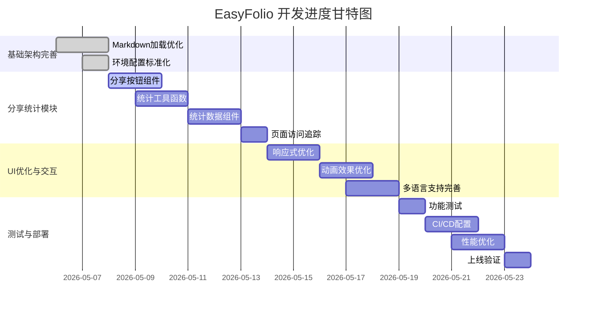

# EasyFolio 开发任务列表

## 项目概述

基于产品PRD和技术方案设计，本项目分为以下核心模块：
1. AI简历分析模块（已完成）
2. 作品集展示模块（已完成）
3. 项目内容管理（已完成 - Markdown文件管理）
4. 分享统计模块（待开发 - 纯前端实现）

**重要说明**：
- 用户注册、登录、个人信息管理模块暂不开发
- 项目数据通过本地Markdown文件管理，使用相对路径调用
- 项目文件备份到GitHub仓库
- 分享统计模块采用纯前端实现，使用localStorage存储数据

---

## 任务拆解与排期

### 第一阶段：基础架构完善（第1周）

| 任务ID | 任务名称 | 描述 | 负责人 | 预估工时 | 依赖 |
|--------|----------|------|--------|----------|------|
| T001 | Markdown加载优化 | 优化静态文件加载方式 | 前端开发 | 6h | - |
| T002 | 环境配置标准化 | 配置开发/生产环境变量 | DevOps | 4h | - |

### 第二阶段：分享统计模块（第2-3周）

| 任务ID | 任务名称 | 描述 | 负责人 | 预估工时 | 依赖 |
|--------|----------|------|--------|----------|------|
| T003 | 分享按钮组件 | 实现社交媒体分享功能 | 前端开发 | 6h | - |
| T004 | 统计工具函数 | 访问量统计逻辑（localStorage） | 前端开发 | 6h | - |
| T005 | 统计数据组件 | 访问统计展示组件 | 前端开发 | 8h | T004 |
| T006 | 页面访问追踪 | 页面加载时自动更新统计 | 前端开发 | 4h | T004 |

### 第三阶段：UI优化与交互增强（第3-4周）

| 任务ID | 任务名称 | 描述 | 负责人 | 预估工时 | 依赖 |
|--------|----------|------|--------|----------|------|
| T007 | 响应式优化 | 完善移动端适配 | 前端开发 | 8h | - |
| T008 | 动画效果优化 | 优化页面过渡和滚动动画 | 前端开发 | 6h | - |
| T009 | 多语言支持完善 | 完善中英文切换功能 | 前端开发 | 6h | - |

### 第四阶段：测试与部署（第4-5周）

| 任务ID | 任务名称 | 描述 | 负责人 | 预估工时 | 依赖 |
|--------|----------|------|--------|----------|------|
| T010 | 功能测试 | 前端功能验证 | 测试工程师 | 4h | T003-T006 |
| T011 | CI/CD配置 | 配置GitHub Actions自动化部署 | DevOps | 6h | T002 |
| T012 | 性能优化 | 代码分割和资源优化 | 前端开发 | 6h | - |
| T013 | 上线验证 | 生产环境功能验证 | 测试工程师 | 4h | T011 |

---

## 任务进度甘特图



---

## 资源需求评估

### 人力需求

| 角色 | 人数 | 职责 |
|------|------|------|
| 前端开发 | 1人 | 分享统计模块、UI优化、交互效果 |
| 测试工程师 | 0.5人 | 功能验证 |
| DevOps | 0.5人 | 环境配置、CI/CD |

### 总工时预估

| 阶段 | 工时（小时） | 占比 |
|------|-------------|------|
| 基础架构完善 | 10h | 12% |
| 分享统计模块 | 24h | 29% |
| UI优化与交互 | 20h | 24% |
| 测试与部署 | 20h | 24% |
| **总计** | **74h** | **100%** |

### 时间预估（5周计划）

| 周数 | 阶段 | 主要任务 |
|------|------|----------|
| 第1周 | 基础架构完善 | Markdown优化、环境配置 |
| 第2周 | 分享统计模块 | 分享按钮、统计工具函数 |
| 第3周 | 分享统计+UI优化 | 统计组件、页面追踪、响应式 |
| 第4周 | UI优化+测试 | 动画效果、多语言、功能测试 |
| 第5周 | 部署上线 | CI/CD配置、性能优化、上线验证 |

---

## 分享统计模块详细设计

### 功能说明

**分享功能**：
- 复制链接到剪贴板
- Web Share API分享到社交媒体
- 支持微信、微博、GitHub、LinkedIn等平台

**统计功能**：
- 总访问量统计
- 今日访问量
- 页面访问统计
- 来源渠道分析

### 数据存储结构

```json
{
  "visits": {
    "total": 156,
    "today": 12,
    "lastWeek": 45,
    "lastMonth": 156
  },
  "pages": {
    "home": 89,
    "project-1": 34,
    "project-2": 23
  },
  "referrers": {
    "direct": 67,
    "github": 45,
    "linkedin": 28
  },
  "lastVisit": "2024-01-15T10:30:00Z"
}
```

---

## 风险与应对策略

| 风险 | 影响 | 可能性 | 应对策略 |
|------|------|--------|----------|
| Coze API服务不可用 | AI分析功能失效 | 低 | 添加错误处理和重试机制 |
| 部署配置复杂 | 用户部署受挫 | 中 | 提供详细部署指南和视频教程 |
| localStorage数据丢失 | 统计数据重置 | 低 | 定期导出备份 |

---

**文档版本**: 1.0.2  
**创建日期**: 2026-05-06  
**状态**: 待评审