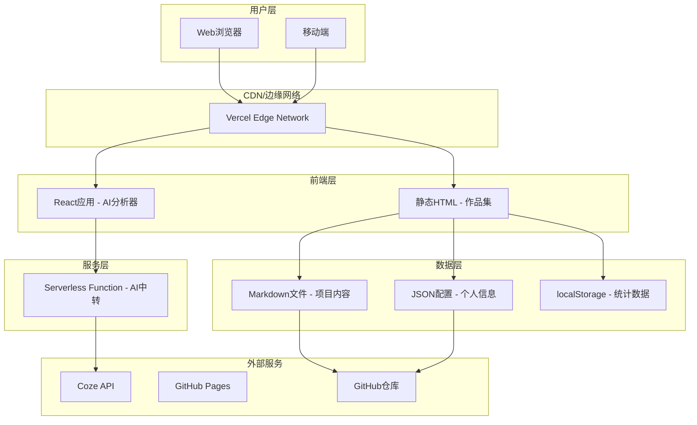
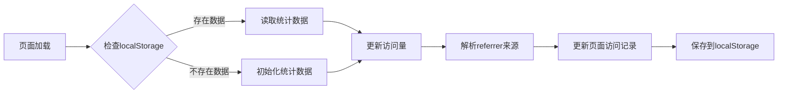
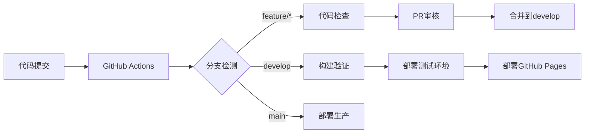

# EasyFolio 技术方案设计文档

## 1. 技术选型

### 1.1 前端技术栈

| 分类 | 技术 | 版本 | 用途 | 选型理由 |
|------|------|------|------|----------|
| 前端框架 | React | 18.x | AI简历分析器界面 | 成熟稳定，生态完善，支持流式响应渲染 |
| 构建工具 | Vite | 5.x | 快速开发和构建 | 速度快，配置简单，原生ESM支持 |
| CSS框架 | Tailwind CSS | 4.x | 样式开发 | 现代化CSS，开发高效，零配置 |
| 路由 | React Router | 7.x | 页面路由管理 | 成熟稳定，支持React 18 |
| 图标库 | Font Awesome | 6.x | 图标展示 | 丰富的图标资源，易于集成 |
| Markdown解析 | marked | 12.x | 案例内容渲染 | 轻量高效，支持GFM语法 |

### 1.2 后端技术栈

| 分类 | 技术 | 版本 | 用途 | 选型理由 |
|------|------|------|------|----------|
| 后端框架 | Express | 4.x | API服务 | 轻量灵活，生态成熟 |
| Serverless | Vercel Serverless Functions | - | AI API中转 | 无需服务器管理，按需计费 |
| AI服务 | Coze API | - | 简历分析和内容生成 | 强大的AI能力，易于集成 |

### 1.3 数据存储方案

| 分类 | 方式 | 用途 | 说明 |
|------|------|------|------|
| 项目数据 | Markdown文件 | 项目案例存储 | 本地文件夹管理，相对路径调用 |
| 配置文件 | JSON/YAML | 个人信息配置 | 本地文件，简单直接 |
| 备份 | GitHub | 版本控制 | 代码和内容一同备份 |
| 统计数据 | localStorage | 访问统计存储 | 纯前端存储，无需后端 |

### 1.4 部署与基础设施

| 分类 | 技术 | 用途 |
|------|------|------|
| 前端托管 | Vercel | AI分析器部署 |
| 静态托管 | GitHub Pages | 作品集网站部署 |
| CI/CD | GitHub Actions | 自动化部署 |

---

## 2. 系统架构设计

### 2.1 整体架构图



### 2.2 模块划分

| 模块 | 职责 | 状态 |
|------|------|------|
| **AI分析模块** | AI对话、流式响应、任务规划解析 | 已完成 |
| **作品集展示模块** | 首页展示、案例详情、技能展示 | 已完成 |
| **项目内容管理** | Markdown文件管理、相对路径调用 | 已完成 |
| **分享统计模块** | 分享功能、访问统计（纯前端） | 待开发 |

### 2.3 API接口设计

#### 2.3.1 AI分析接口

| API路径 | 方法 | 描述 | 参数 | 返回值 |
|---------|------|------|------|--------|
| `/api/chat` | POST | AI对话接口 | `{ message: string }` | 流式响应 |

---

## 3. 数据存储设计

### 3.1 项目文件结构

```
easyfolio-portfolio/
├── content/
│   ├── projects/
│   │   ├── project-1.md
│   │   ├── project-2.md
│   │   ├── project-3.md
│   │   └── project-4.md
│   └── profile.json
├── assets/
│   ├── images/
│   │   └── project-covers/
│   └── ...
└── ...
```

### 3.2 Markdown文件格式（项目案例）

```markdown
---
title: 项目名称
date: 2024-01-15
category: Web Development
tags: ["React", "Node.js", "TypeScript"]
techStack: ["React 18", "Node.js", "MongoDB", "Tailwind CSS"]
coverImage: ../assets/images/project-covers/project-1.png
projectUrl: https://github.com/example/project
order: 1
---

## 项目概述

项目简介描述...

## 挑战

遇到的挑战和问题...

## 解决方案

解决方案和实施策略...

## 实施方法

具体实施步骤...

## 成果展示

取得的成果和数据...
```

### 3.3 配置文件格式（profile.json）

```json
{
  "name": "张三",
  "title": "高级前端工程师",
  "bio": "专注于Web开发，拥有5年以上前端开发经验...",
  "skills": ["React", "Vue", "TypeScript", "Node.js", "AWS"],
  "contact": {
    "email": "zhangsan@example.com",
    "phone": "138xxxx8888",
    "github": "https://github.com/zhangsan",
    "linkedin": "https://linkedin.com/in/zhangsan"
  },
  "location": "北京市"
}
```

### 3.4 前端统计数据存储格式

```json
{
  "visits": {
    "total": 156,
    "today": 12,
    "lastWeek": 45,
    "lastMonth": 156
  },
  "pages": {
    "home": 89,
    "project-1": 34,
    "project-2": 23,
    "project-3": 10
  },
  "referrers": {
    "direct": 67,
    "github": 45,
    "linkedin": 28,
    "other": 16
  },
  "lastVisit": "2024-01-15T10:30:00Z"
}
```

---

## 4. 分享统计模块设计（纯前端）

### 4.1 分享功能

| 分享平台 | 实现方式 |
|----------|----------|
| 微信 | 复制链接到剪贴板 |
| 微博 | 使用Web Share API |
| GitHub | 直接跳转 |
| LinkedIn | 使用Web Share API |
| 复制链接 | Clipboard API |

### 4.2 统计功能

| 统计项 | 存储方式 | 更新时机 |
|--------|----------|----------|
| 总访问量 | localStorage | 页面加载时 |
| 今日访问 | localStorage | 页面加载时 |
| 页面访问 | localStorage | 页面加载时 |
| 来源渠道 | localStorage | 页面加载时解析referrer |

### 4.3 统计更新逻辑



---

## 5. 第三方服务集成

### 5.1 Coze API集成

```
用户消息 → Express API → Vercel Serverless → Coze API → 流式响应 → 用户
```

**环境变量配置**：
```bash
COZE_API_KEY=your_api_key_here
COZE_BOT_ID=your_bot_id_here
COZE_API_BASE_URL=https://api.coze.cn
```

### 5.2 部署服务

| 服务 | 配置 |
|------|------|
| Vercel | 前端托管 + Serverless Functions |
| GitHub Pages | 静态作品集网站 |

---

## 6. 安全架构

### 6.1 安全措施

| 层级 | 措施 | 说明 |
|------|------|------|
| API密钥保护 | Serverless中转 | API Key保存在环境变量中，前端不直接访问 |
| 数据传输 | HTTPS加密 | Vercel默认支持HTTPS |
| 环境隔离 | 开发/生产环境区分 | 使用不同配置 |

---

## 7. 开发环境配置

### 7.1 Git分支策略

| 分支 | 用途 |
|------|------|
| main | 生产环境代码 |
| develop | 开发主干分支 |
| feature/* | 功能开发分支 |
| bugfix/* | Bug修复分支 |
| release/* | 发布准备分支 |

### 7.2 环境配置

#### 开发环境（.env.development）
```bash
NODE_ENV=development
COZE_API_KEY=dev_key
COZE_BOT_ID=dev_bot_id
```

#### 生产环境（.env.production）
```bash
NODE_ENV=production
COZE_API_KEY=${{ secrets.COZE_API_KEY }}
COZE_BOT_ID=${{ secrets.COZE_BOT_ID }}
```

### 7.3 CI/CD流程



---

**文档版本**: 1.0.2  
**创建日期**: 2026-05-06  
**状态**: 待评审